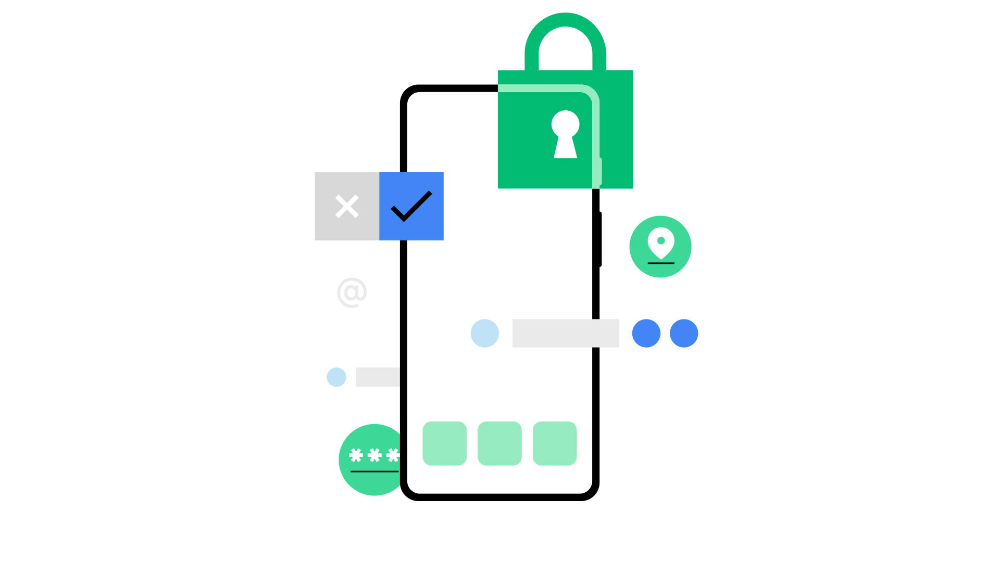

# Privacy Sandbox on Android developer tools

This repo holds developer tools for
[Privacy Sandbox on Android](https://privacysandbox.com/android). The goal is to
build tooling for ad tech develpers to enjoy a great developer experience when
developing for Privacy Sandbox on Android. 

 

## Documentation

*   See our documentation on
    [Android Developers](https://developer.android.com/design-for-safety/privacy-sandbox).
*   Not a developer? Learn more about Privacy Sandbox on Android
    [here](http://privacysandbox.com/android).

## AdServices CLI

A developer tool for interacting with your test device when developing for
Protected Audience and Protected App Signals.

See the [README](./adservices_cli/README.md) for more details.

## Contributing & Feedback

Please contribute!

We're specifically looking for feedback on the developer experience of Privacy
Sandbox on Android. The tools shared here are experimental, but we're sharing
them with the goal of collaborating with the community on their development.
Feedback can be filed as a GitHub Issue or Discussion.

We will gladly review any pull requests submitted. Please see
[`CONTRIBUTING.md`](CONTRIBUTING.md) for details.

## License

Apache 2.0; see [`LICENSE`](LICENSE) for details.
